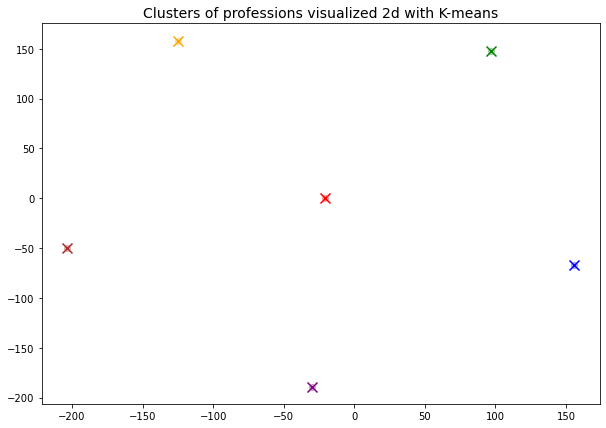

# 1. O Problema

Escolher uma profissão torna-se uma necessidade em determinada época de nossas vidas e os jovens têm grande dificuldade em fazer essa opção, principalmente porque o número de profissões aumenta cada vez mais e o mercado de trabalho torna-se cada vez mais exigente e competitivo.

Para isso será necessário que conheça suas habilidade, seus interesses e sua motivação. É aí que a QueroFuturp pode ser de grande ajuda, facilitando esse momento de escolha, auxiliando o jovem a compreender os vários fatores a considerar: aspectos pessoais, relacionais e sociais. Conhecendo todas essas variáveis ele terá mais condições para definir melhor sua escolha.

# 2. Evasão

Segundo estudos do <a href="https://www.semesp.org.br/mapa/edicao-11/brasil/evasao/">Instituto Semesp</a>, para cursos presenciais temos uma taxa de evasao de <b>30%</b> dos alunos de rede privada e de <b>18,4%</b> da rede publica, isso para o ano de 2019. Para os cursos de EAD, a taxa para a rede publica quase dobra, chegando a <b>31,6%.</b>

 

Para os anos de pandemia, os numeros para o setor privado elevam para <b>37,2%</b> em 2020 e <b>36,6%</b> em 2021.

Os motivos para que isso aconteca, sao diversos, desde trabalho, perca do emprego durantes esses anos, a falta de renda, falta de infraestrutura, <i><b>desvinculação em relação ao curso</i></b>.

# 3. A solução 

## 3.1 Dados utilizados

## 3.2 Arquitetura do Modelo

<a href='model/Ada_Embedding_Test.ipynb'>Analise exploratoria e treinamento do modelo;</a>

Exemplo de arquitetura:

 

## 3.3 Resultados

Exemplo de visualização: 

Cada <i><b>"x"</b></i> nesse grafico representa o centro de um cluster ou uma determinada "profissao" conforme novos dados sao adicionados, a.

Para criar essa visualização, utilizamos o metodo de reducao dimensional chamado <a href="https://www.jmlr.org/papers/volume9/vandermaaten08a/vandermaaten08a.pdf?fbcl">t-SNE</a>, com ele a dimensao dos dados que possuimos caiu para apenas 2.

 

# 4. Arquitetura do Projeto

Nosso front end foi desenvolvido utilizando o framework Angular em javascript, enquanto nosso backend foi implementado usando o framework flask em python.

# 5. Monetizacao 

## 5.1 Markeplace 

# 6. Bibliotecas Necessarias (python)

* os;
* pickle;
* openai;
* tiktoken;
* numpy;
* pandas;
* sklearn;
* flask;
* matplotlib;
* plotly;

# Fontes

* <a href="https://www.semesp.org.br/mapa/edicao-11/brasil/evasao/">Instuto Semesp</a>;
* <a href="https://g1.globo.com/educacao/noticia/2022/01/02/quase-35-milhoes-de-alunos-evadiram-de-universidades-privadas-no-brasil-em-2021.ghtml">Quase 3,5 milhões de alunos evadiram de universidades privadas no Brasil em 2021</a>;
* <a href="https://platform.openai.com/docs/guides/embeddings/what-are-embeddings">Open IA Embeddings;</a>
* <a href="https://www.sciencedirect.com/science/article/abs/pii/S1574013721000186">Conceptual and empirical comparison of dimensionality reduction algorithms (PCA, KPCA, LDA, MDS, SVD, LLE, ISOMAP, LE, ICA, t-SNE)</a>

